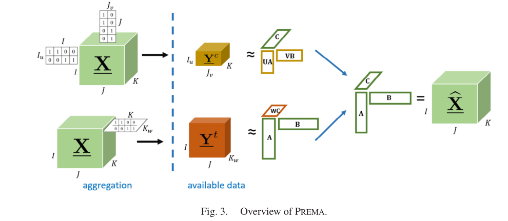

<!-- _class: lead -->

# Tensor Data Recovery <!-- fit -->
## from multiple aggregated views 

Evgeny Noi

---
# Background 

- Data recovery is common in remote sensing imagery (two images of different resolution) and in ML (super resolution applications) 
- While deep learning solutions are effective for images, the do not translate well to socio-demographic data (sociology, economics, political science), where most of the restoration works is driven by Bayesian inferences
- **Solution: Coupled Matrix-Tensor Factorization!**

---

---
# Methods

$$
\min_{\mathcal{F}}(A,B,C):=||\Omega^t \times (Y^t - ([[A,B,WC]])||_{F}^{2} + ||\Omega^c \times (Y^c - ([[UA,VB,C]])||_{F}^{2}
$$

* where $\Omega^{t/c}$ are weight tensors (0/1);  
* W, U, V - are mixing (aggregation) matrices
* Y^t and Y^c - are two aggregated views

---
# Data 

- Mapbox data (100m by 100m) 
- SafeGraph Census Block Group data 

---
# Methods 

* Implement PREMA
* Add probabilistic (uncertainty) estimation to 'restored' data

--- 
# Thanks! <!-- fit -->